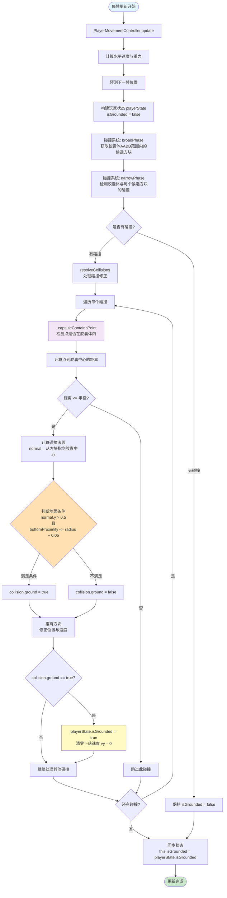

# 玩家地面检测逻辑流程图



## 关键判断条件

### 1. 地面检测条件（`_capsuleContainsPoint` 方法）

```javascript
// 判断是否接地：法线朝上且接触点靠近胶囊底部球体
const bottomProximity = local.y + halfHeight  // 接触点到胶囊底部中心的相对高度
const ground = normal.y > 0.5 && bottomProximity <= radius + 0.05
```

**条件说明：**
- `normal.y > 0.5`：碰撞法线的 Y 分量必须大于 0.5（法线向上）
- `bottomProximity <= radius + 0.05`：接触点必须在胶囊底部球体附近（半径 + 0.05 的容差范围内）

### 2. 碰撞处理流程（`resolveCollisions` 方法）

1. **排序碰撞**：按重叠深度从小到大排序，优先处理浅层碰撞
2. **推离方块**：沿法线方向推离玩家，消除穿透
3. **速度修正**：去除沿法线方向的速度分量
4. **地面判定**：如果 `collision.ground == true`，则：
   - 设置 `playerState.isGrounded = true`
   - 清零下落速度 `worldVelocity.y = 0`

### 3. 状态同步

每帧更新完成后，将 `playerState.isGrounded` 同步到 `PlayerMovementController.isGrounded`，供其他系统（如动画系统、跳跃系统）使用。

## 相关文件

- `src/js/world/player/player-collision.js`：碰撞检测核心逻辑
- `src/js/world/player/player-movement-controller.js`：移动控制器，调用碰撞系统
- `src/js/world/player/player.js`：玩家主类，使用 `isGrounded` 状态
